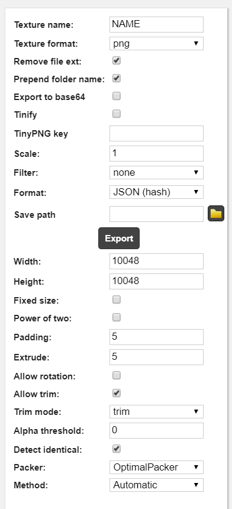

## Friday Night Funkin' - Wednesday's Infidelity [PART 2]

The GitHub repository for Wednesday's Infidelity Part 2.

For info on usage rights, please read the [license](https://github.com/lunarcleint/Wednesdays-Infidelity-PART-2/blob/master/LICENSE)!


### Credits:

Add these later

## Documenation
- [Building the game](#building-instructions)
- [Sprite sheet formats](#data-formats)

### Building Instructions:
Follow the [Friday Night Funkin'](https://github.com/ninjamuffin99/Funkin#build-instructions) source code building guide.

****IMPORTANT W.I SPECIFIC BUILDING INSTRUCTIONS:****

Run these commands: 
```
haxelib install hxp
haxelib git flxanimate https://github.com/Dot-Stuff/flxanimate
haxelib install hscript
haxelib install hxCodec
```
These libraries are needed and your game will **NOT** build without them!

## Data Formats

W.I Supports four built in data types:
- Genric Xmls (Commonly Supported in game engines)
- Sparrow V1-2 (Default FNF Format)
- Packer (Week 6 TXT Format)
- Json Format (HASH and Array Supported)

These are layed out in the enum [Data Type](https://github.com/lunarcleint/Wednesdays-Infidelity/blob/master/source/data/DataType.hx)
```haxe
enum DataType
{
	GENERICXML;
	SPARROW;
	PACKER;
	JSON;
}
```
[Paths](https://github.com/lunarcleint/Wednesdays-Infidelity/blob/master/source/util/Paths.hx) has a easy function to get frames based on a [Data Type](https://github.com/lunarcleint/Wednesdays-Infidelity/blob/master/source/data/DataType.hx) value. [getAtlasFromData(key:String, data:DataType, ?library:String)](https://github.com/lunarcleint/Wednesdays-Infidelity/blob/master/source/util/Paths.hx#L342).

Also [Character.hx](https://github.com/lunarcleint/Wednesdays-Infidelity/blob/master/source/gameObjects/Character.hx) has a data type paramter that can easily be edited.


####**NOTE**
- You have to click reload image for the data type to update
- Sometimes it will crash when you do that so you should just add to to the Json

### Creating Sprite Sheets

####**NOTE**
- **THIS IS FOR SCALING SPRITE SHEETS**

Download [Free Texture Packer](http://free-tex-packer.com/) and Install it.

Now you want to export your adobe animate animations as a PNG Sequence.


####**NOTE**
- **MAKE SURE YOUR DPI IS 72 (THE DEFAUT)** 

Then put all of it into [Free Texture Packer](http://free-tex-packer.com/) with these settings: 

and click `Export`!

That's it now you can scale you sprite sheet to any scale you want!

