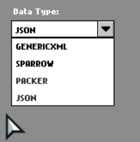
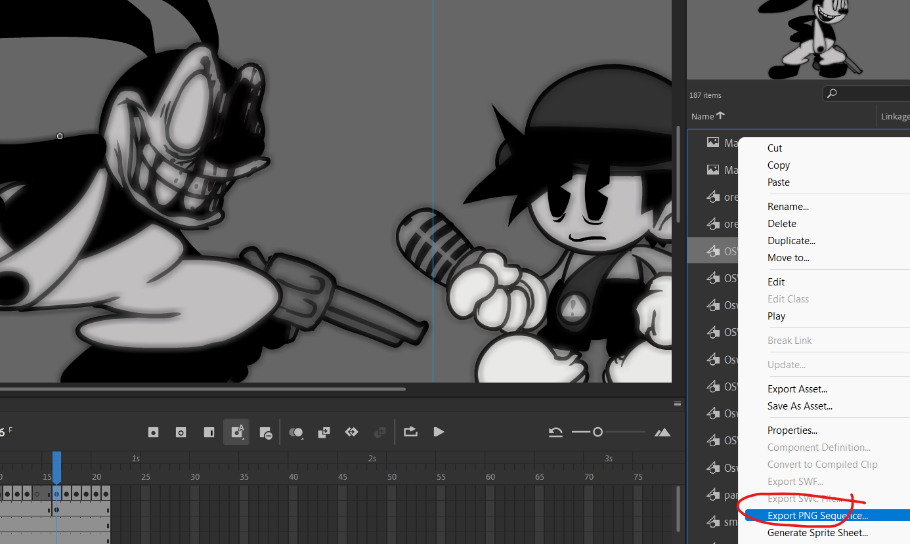
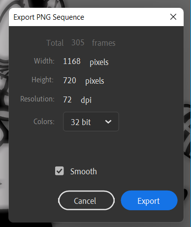

## Friday Night Funkin' - Wednesday's Infidelity
For info on usage rights, please read the [license](https://github.com/lunarcleint/Wednesdays-Infidelity-PART-2/blob/master/LICENSE)!


## Documenation
- [Building the game](#building-instructions)
- [Debug features](#debug-features)
- [Sprite sheet formats](#data-formats)

### Building Instructions:
Follow the [Friday Night Funkin'](https://github.com/ninjamuffin99/Funkin#build-instructions) source code building guide.

****IMPORTANT W.I SPECIFIC BUILDING INSTRUCTIONS:****

Run these commands: 
```
haxelib install hxp
haxelib git flxanimate https://github.com/Dot-Stuff/flxanimate
haxelib set flxanimate 1.2.0
haxelib install hscript
haxelib install hxCodec
haxelib set hxCodec 2.5.1
```
Or run the setup [bat](https://github.com/lunarcleint/Wednesdays-Infidelity/blob/master/config.bat).

These libraries are needed and your game will **NOT** build without them!

## Debug Features

With the tag `<define name="PRIVATE_BUILD"/> ` in the [Project.xml](https://github.com/lunarcleint/Wednesdays-Infidelity/blob/master/Project.xml), you unlock these debug features...
- Press 3 to pause the game no matter what
- Press T on the main menu to 100% the game
- Always allowed to delete your progress even if you just reset
- Able to skip ANY cutscene/video playing
- Automatticly hides Discord RPC
- Able to toggle botplay
- Able to skip the intro 

## Data Formats

W.I Supports four built in data types:
- Genric Xmls (Commonly Supported in game engines)
- Sparrow V1-2 (Default FNF Format)
- Packer (Week 6 TXT Format)
- Json Format (HASH and Array Supported)

[Paths](https://github.com/lunarcleint/Wednesdays-Infidelity/blob/master/source/util/Paths.hx) has a easy function to get frames based on a [Data Type](https://github.com/lunarcleint/Wednesdays-Infidelity/blob/master/source/data/DataType.hx) value. [getAtlasFromData(key:String, data:DataType, ?library:String)](https://github.com/lunarcleint/Wednesdays-Infidelity/blob/master/source/util/Paths.hx#L342).

Also [Character.hx](https://github.com/lunarcleint/Wednesdays-Infidelity/blob/master/source/gameObjects/Character.hx) has a data type paramter that can easily be edited.



****NOTE:****
You have to click reload image for the data type to update
Sometimes it will crash when you do that so you should just add to to the Json

### Scaling Sprite Sheets

Download [Free Texture Packer](http://free-tex-packer.com/) and Install it.

Now you want to export your adobe animate animations as a PNG Sequence, ****make sure your DPI is 72****.



Then put all of it into [Free Texture Packer](http://free-tex-packer.com/) with these settings (you can change these to your liking): 


After you've made the sprite sheet look good, export the sprite sheet.